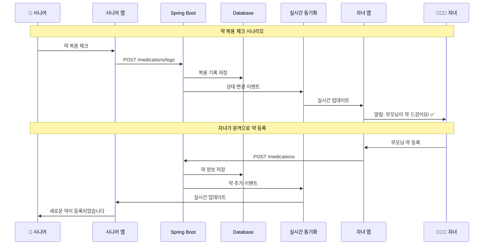
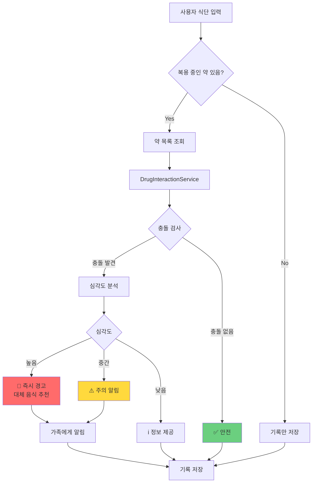
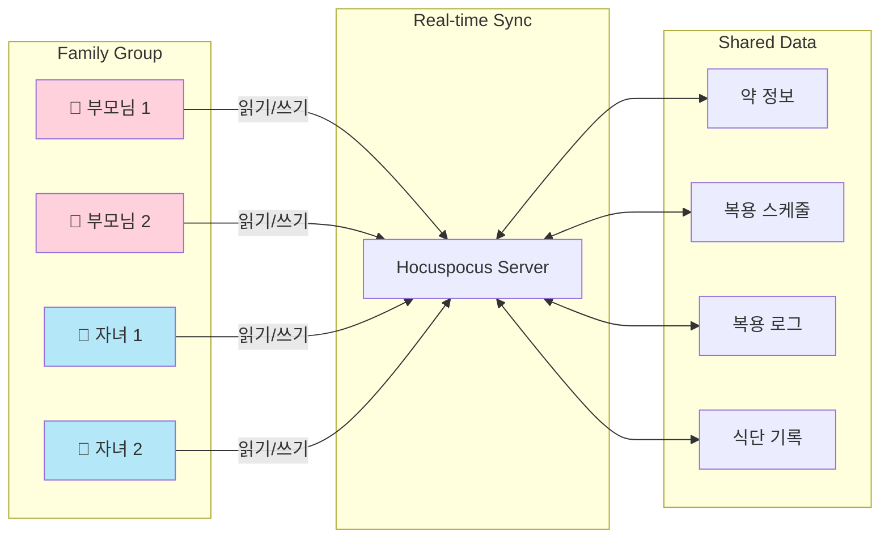
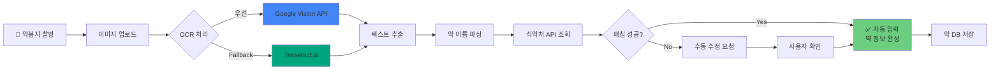
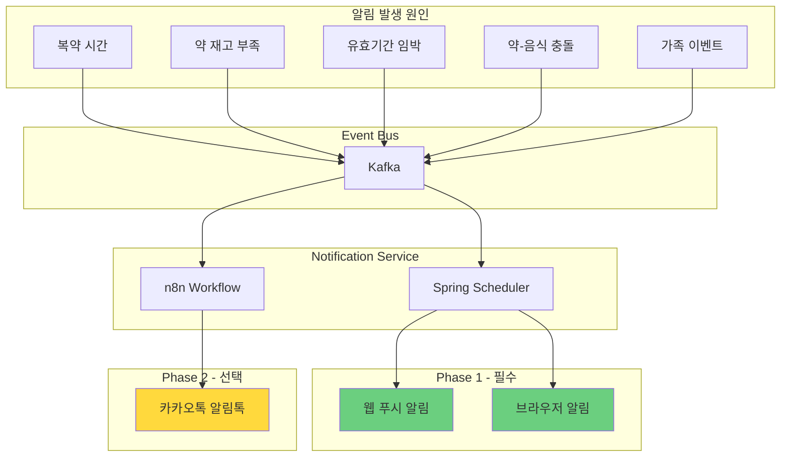
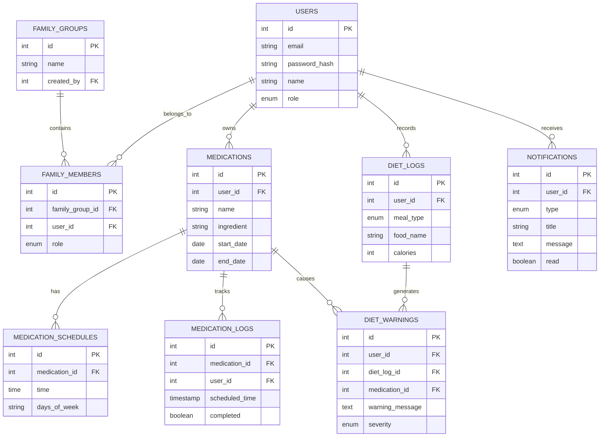
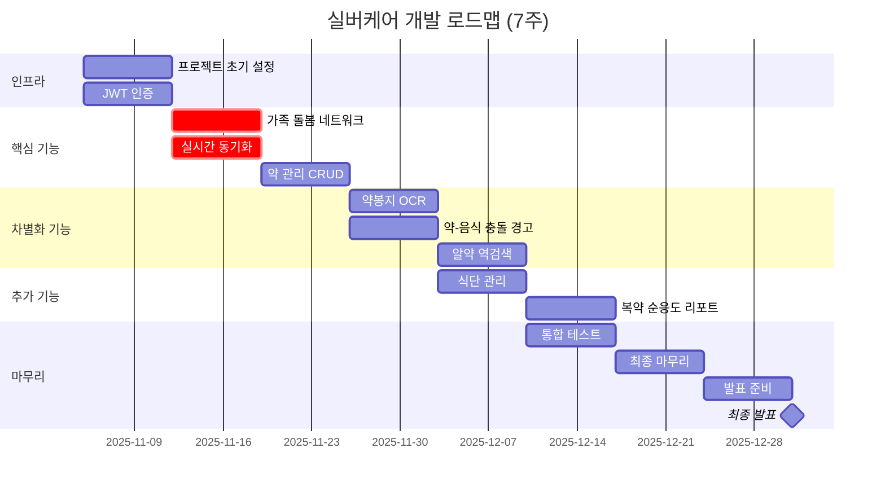
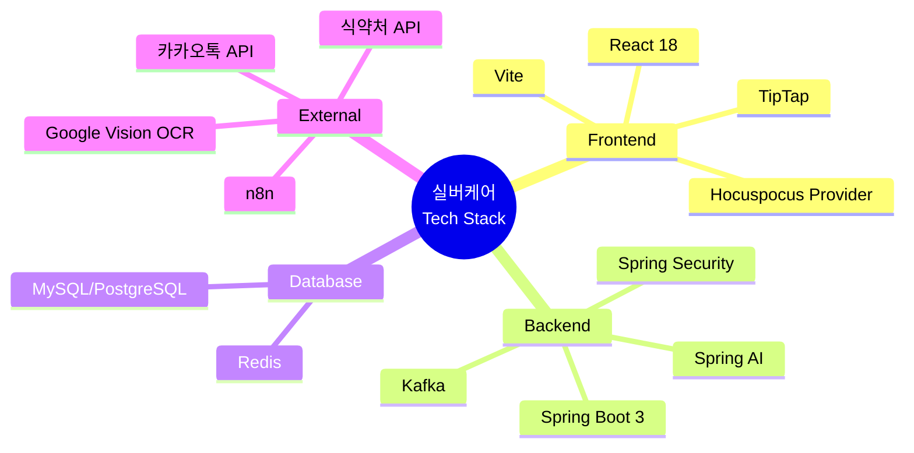

# 실버케어 시스템 아키텍처

## 전체 시스템 구조

```mermaid
graph TB
    subgraph "Frontend Layer"
        A[React Web App]
        A1[Auth Components]
        A2[Family Components]
        A3[Medication Components]
        A4[Diet Components]
        A5[Dashboard]

        A --> A1
        A --> A2
        A --> A3
        A --> A4
        A --> A5
    end

    subgraph "Real-time Sync"
        H[Hocuspocus Server]
        H1[Family WebSocket]
    end

    subgraph "Backend Layer"
        B[Spring Boot API]
        B1[Auth Controller]
        B2[Medication Controller]
        B3[Family Controller]
        B4[Diet Controller]

        B --> B1
        B --> B2
        B --> B3
        B --> B4

        S1[Medication Service]
        S2[Family Service]
        S3[Drug Interaction Service]
        S4[OCR Service]

        B2 --> S1
        B3 --> S2
        B4 --> S3
        B2 --> S4
    end

    subgraph "Event Processing"
        K[Apache Kafka]
        K1[Medication Events]
        K2[Notification Events]

        K --> K1
        K --> K2
    end

    subgraph "Database Layer"
        DB[(MySQL/PostgreSQL)]
        R[(Redis Cache)]
    end

    subgraph "External Services"
        E1[식약처 API]
        E2[Google Vision OCR]
        E3[카카오톡 API]
        E4[n8n Workflow]
    end

    A -->|REST API| B
    A -->|WebSocket| H
    H --> B

    B --> DB
    B --> R
    B --> K

    B --> E1
    S4 --> E2
    B --> E3
    K --> E4

    style A fill:#61dafb
    style B fill:#6db33f
    style K fill:#231f20
    style DB fill:#4479a1
    style R fill:#dc382d
```

## 데이터 흐름도

## 약-음식 충돌 감지 플로우

## 가족 돌봄 네트워크 구조

## OCR 처리 파이프라인

## 알림 시스템 아키텍처

## 데이터베이스 ERD (간략)

## 7주 개발 타임라인

## 기술 스택

---

## 참고 사항

- **실시간 동기화**: Hocuspocus를 통한 WebSocket 기반 가족 간 데이터 동기화
- **이벤트 기반 아키텍처**: Kafka를 통한 비동기 알림 처리
- **OCR 우선순위**: Google Vision → Tesseract.js Fallback
- **약-음식 충돌**: 룰 베이스 시스템 (AI 불필요)
- **알림**: Phase 1 (웹 푸시) 필수, Phase 2 (카카오톡) 선택

**문서 버전**: 1.0
**생성일**: 2025-11-05
**상태**: Mermaid 다이어그램 완성
