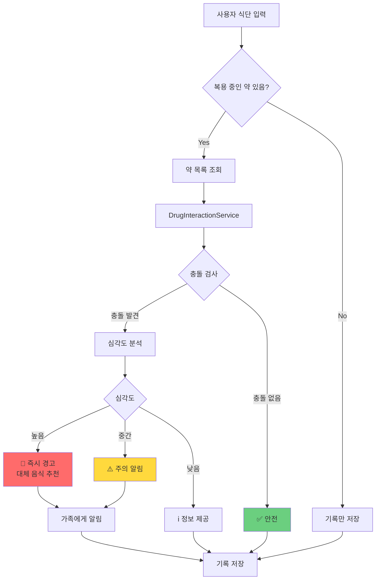
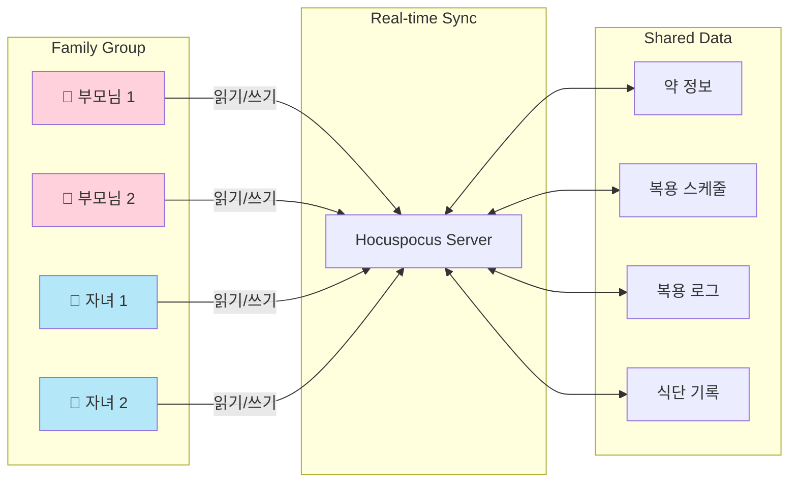
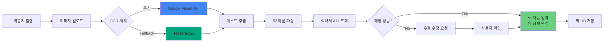
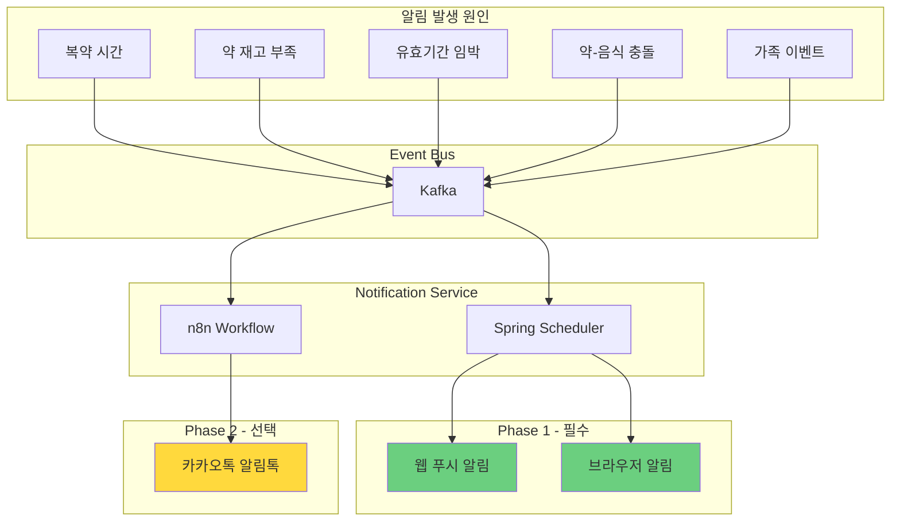
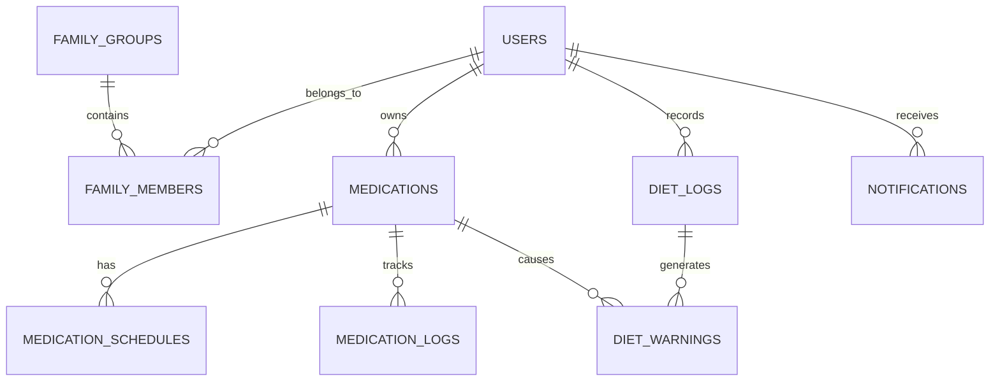
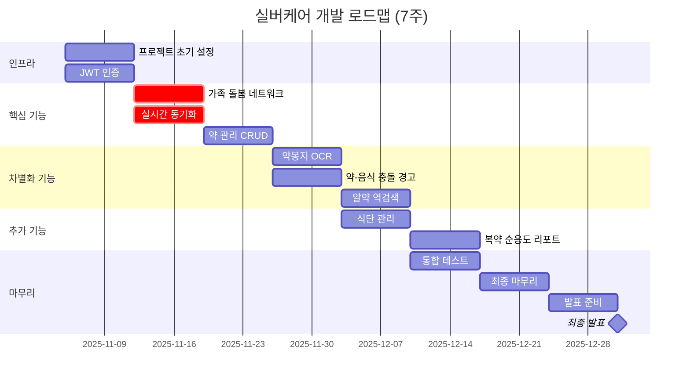
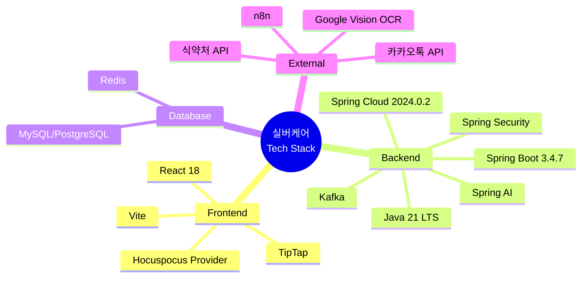

```mermaid
graph TB
    subgraph "Frontend Layer"
        A[React Web App]
        A1[Auth Components]
        A2[Family Components]
        A3[Medication Components]
        A4[Diet Components]
        A5[Dashboard]

        A --> A1
        A --> A2
        A --> A3
        A --> A4
        A --> A5
    end

    subgraph "Real-time Sync"
        H[Hocuspocus Server]
        H1[Family WebSocket]
    end

    subgraph "Backend Layer"
        B[Spring Boot API]
        B1[Auth Controller]
        B2[Medication Controller]
        B3[Family Controller]
        B4[Diet Controller]

        B --> B1
        B --> B2
        B --> B3
        B --> B4

        S1[Medication Service]
        S2[Family Service]
        S3[Drug Interaction Service]
        S4[OCR Service]

        B2 --> S1
        B3 --> S2
        B4 --> S3
        B2 --> S4
    end

    subgraph "Event Processing"
        K[Apache Kafka]
        K1[Medication Events]
        K2[Notification Events]

        K --> K1
        K --> K2
    end

    subgraph "Database Layer"
        DB[(MySQL/PostgreSQL)]
        R[(Redis Cache)]
    end

    subgraph "External Services"
        E1[식약처 API]
        E2[Google Vision OCR]
        E3[카카오톡 API]
        E4[n8n Workflow]
    end

    A -->|REST API| B
    A -->|WebSocket| H
    H --> B

    B --> DB
    B --> R
    B --> K

    B --> E1
    S4 --> E2
    B --> E3
    K --> E4

    style A fill:#61dafb
    style B fill:#6db33f
    style K fill:#231f20
    style DB fill:#4479a1
    style R fill:#dc382d
```

# 실버케어 시스템 아키텍처

> 가족 돌봄 네트워크 기반 약 관리 플랫폼

## 📁 다이어그램 파일 목록

모든 Mermaid 다이어그램은 `diagrams/` 폴더에 개별 파일로 저장되어 있습니다.

| 파일명 | 설명 | 용도 |
|--------|------|------|
| `01-system-architecture.mmd` | 전체 시스템 구조 | Frontend, Backend, Database, External Services |
| `02-data-flow.mmd` | 데이터 흐름도 | 시니어-자녀 간 실시간 동기화 시퀀스 |
| `03-drug-food-interaction.mmd` | 약-음식 충돌 감지 | 충돌 검사 및 경고 플로우차트 |
| `04-family-network.mmd` | 가족 돌봄 네트워크 | Hocuspocus 기반 실시간 공유 구조 |
| `05-ocr-pipeline.mmd` | OCR 처리 파이프라인 | 약봉지 인식 → 자동 등록 플로우 |
| `06-notification-system.mmd` | 알림 시스템 | Kafka 이벤트 기반 알림 아키텍처 |
| `07-database-erd.mmd` | 데이터베이스 ERD | Mermaid 버전 (간략) |
| `08-development-timeline.mmd` | 7주 개발 타임라인 | Gantt 차트 |
| `09-tech-stack.mmd` | 기술 스택 | Mindmap 형식 |

---

## 1️⃣ 전체 시스템 구조

**파일**: `diagrams/01-system-architecture.mmd`

### 주요 구성 요소

- **Frontend**: React 18 + Vite (JSX only, React Native 사용 금지)
- **Backend**: Spring Boot 3 + Spring Security + Spring AI
- **Real-time**: Hocuspocus Server (WebSocket 기반 가족 간 동기화)
- **Event Bus**: Apache Kafka (비동기 이벤트 처리)
- **Database**: MySQL/PostgreSQL (주 DB), Redis (캐시/세션)
- **External**: 식약처 API, Google Vision OCR, 카카오톡 알림톡, n8n

---

## 2️⃣ 데이터 흐름도

**파일**: `diagrams/02-data-flow.mmd`

### 핵심 시나리오

1. **시니어 → 자녀**: 부모님이 약 복용 체크 → 자녀에게 실시간 알림
2. **자녀 → 시니어**: 자녀가 원격으로 약 등록 → 부모님 웹에 즉시 반영

---

## 3️⃣ 약-음식 충돌 감지 플로우

**파일**: `diagrams/03-drug-food-interaction.mmd`

### 차별화 기능

- 룰 베이스 시스템 (AI 불필요)
- 심각도별 차등 대응 (높음/중간/낮음)
- 가족에게 즉시 알림 (높음/중간 등급)

---

## 4️⃣ 가족 돌봄 네트워크 구조

**파일**: `diagrams/04-family-network.mmd`

### 핵심 가치

- 떨어져 있어도 부모님 건강 관리 가능
- 실시간 양방향 동기화 (WebSocket)
- 권한 관리 (읽기/쓰기 분리 가능)

---

## 5️⃣ OCR 처리 파이프라인

**파일**: `diagrams/05-ocr-pipeline.mmd`

### OCR 전략

- **우선순위 1**: Google Vision API (무료 1,000건/월, 인식률 95%+)
- **Fallback**: Tesseract.js (완전 무료, 인식률 80%)
- Naver Clova OCR 제외 (유료)

---

## 6️⃣ 알림 시스템 아키텍처

**파일**: `diagrams/06-notification-system.mmd`

### 알림 전략

- **Phase 1 (필수)**: 웹 푸시 알림, 브라우저 알림
- **Phase 2 (선택)**: 카카오톡 알림톡 (시간 있으면)
- React Native 사용 금지 → 모바일 네이티브 알림 불가

---

## 7️⃣ 데이터베이스 ERD

**파일**: `diagrams/07-database-erd.mmd`

상세한 ERD는 `database-erd.dbml` 파일 참조 (dbdiagram.io 형식)

### 주요 테이블 (10개)

1. `users` - 사용자 정보
2. `family_groups` - 가족 그룹
3. `family_members` - 가족 구성원 매핑
4. `medications` - 약 정보
5. `medication_schedules` - 복용 일정
6. `medication_logs` - 복용 기록
7. `drug_food_interactions` - 약-음식 충돌 정보
8. `diet_logs` - 식단 기록
9. `diet_warnings` - 식단-약 충돌 경고
10. `notifications` - 알림

---

## 8️⃣ 7주 개발 타임라인

**파일**: `diagrams/08-development-timeline.mmd`

### 주요 마일스톤

- **Week 1-2**: 인프라 + 가족 돌봄 네트워크 (핵심!)
- **Week 3-4**: 약 관리 + 차별화 기능 (OCR, 약-음식 충돌)
- **Week 5-6**: 추가 기능 + 통합 테스트
- **Week 7-8**: 마무리 + 발표 준비
- **12/31**: 최종 발표일 🎉

---

## 9️⃣ 기술 스택

**파일**: `diagrams/09-tech-stack.mmd`

### 백엔드 기술 스택 선정 이유

#### Java 21 LTS
- **장기 지원**: 2029년까지 지원 보장
- **Virtual Threads**: 고성능 동시성 처리
- **ZGC**: 저지연 가비지 컬렉션
- **프로덕션 검증**: 충분히 안정화된 LTS 버전

#### Spring Boot 3.4.7 (2025년 6월)
- **안정성**: 6개월 이상 검증된 안정 버전
- **버그 수정**: 49개 버그 수정 및 의존성 업그레이드
- **프로덕션 준비**: 실무 환경에서 충분히 검증됨
- **3.5.0 제외 이유**: 너무 최신 (2025년 5월 출시, 검증 부족)

#### Spring Cloud 2024.0.2 (Moorgate)
- **Spring Boot 3.4.x 완벽 호환**
- **Spring Framework 6.2.0 통합**
- **Eureka Server 최신 기능 지원**
- **마이크로서비스 아키텍처 대비**

---

## 📖 사용 방법

### GitHub에서 보기
GitHub는 `.md` 파일 내의 Mermaid 코드 블록을 자동 렌더링합니다.

### VS Code에서 보기
1. Mermaid 플러그인 설치
2. `.mmd` 파일 또는 `.md` 파일 열기
3. 미리보기 패널에서 확인

### Mermaid Live Editor
1. https://mermaid.live 접속
2. `diagrams/*.mmd` 파일 내용 복사
3. 실시간 편집 및 내보내기 (PNG, SVG)

### Notion/Obsidian
Mermaid 코드 블록을 복사해서 붙여넣기

---

## 📝 참고 사항

- **실시간 동기화**: Hocuspocus (WebSocket)
- **이벤트 기반**: Kafka (비동기 처리)
- **OCR**: Google Vision → Tesseract Fallback
- **약-음식 충돌**: 룰 베이스 시스템
- **알림**: Phase 1 필수, Phase 2 선택
- **React Native 금지**: 웹 앱만 사용

---

**문서 버전**: 2.0 (개별 파일 분리)
**생성일**: 2025-11-05
**상태**: Mermaid 다이어그램 완성 (9개 파일)
